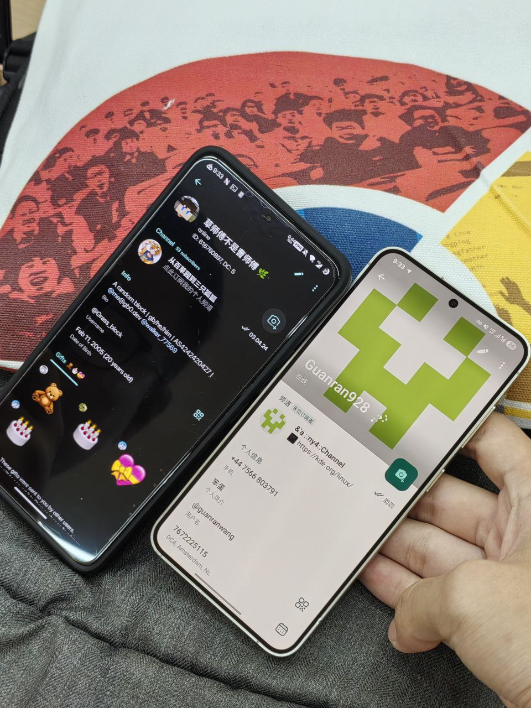
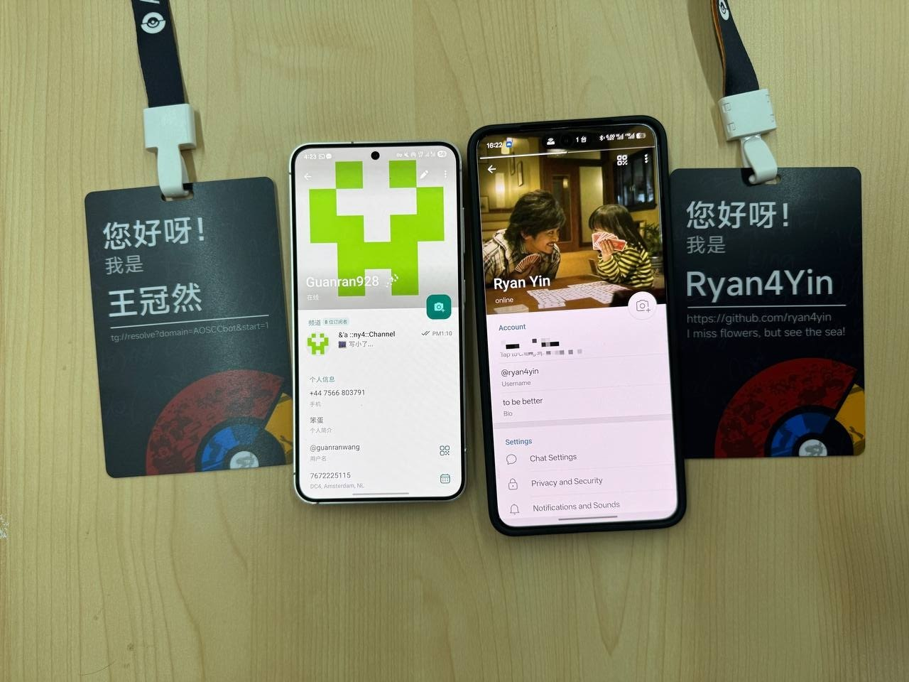
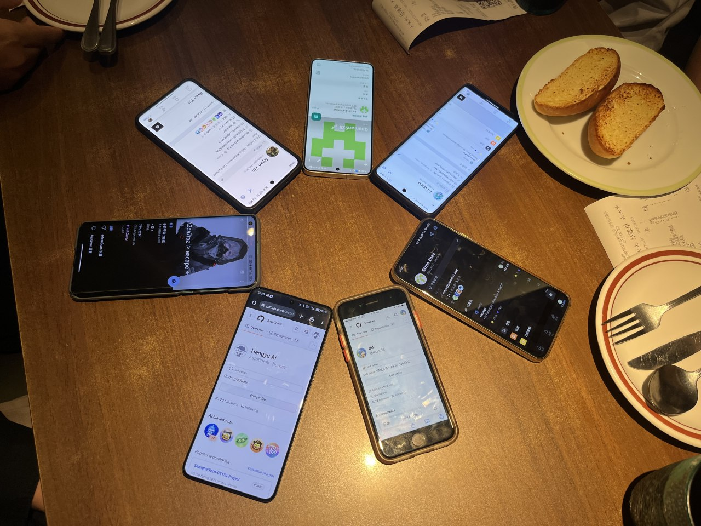
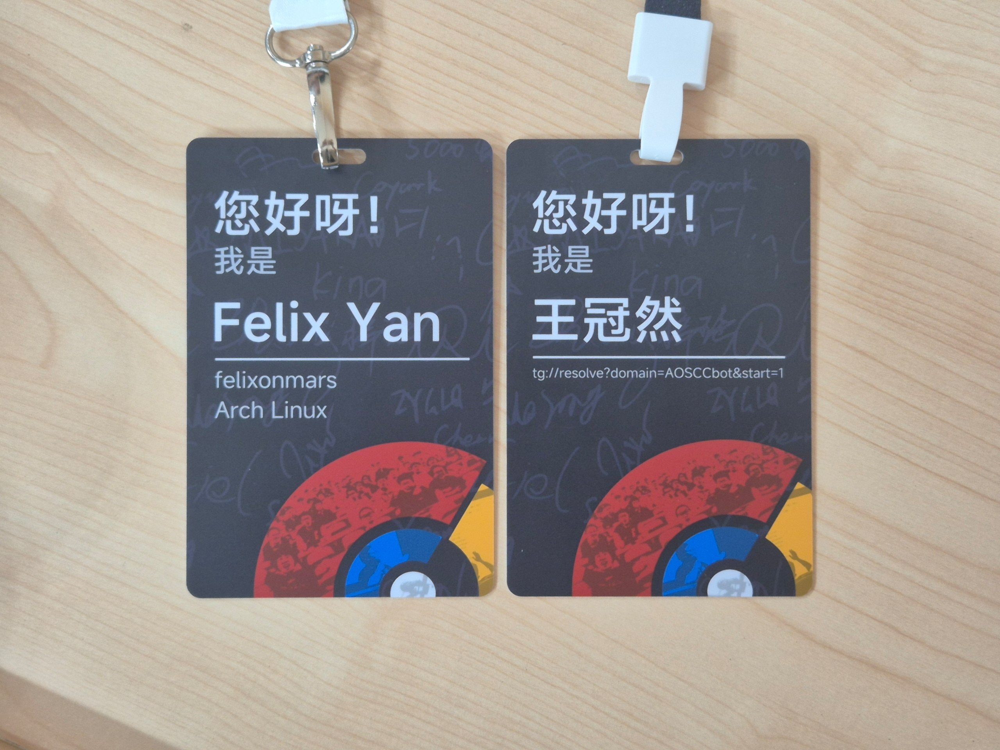
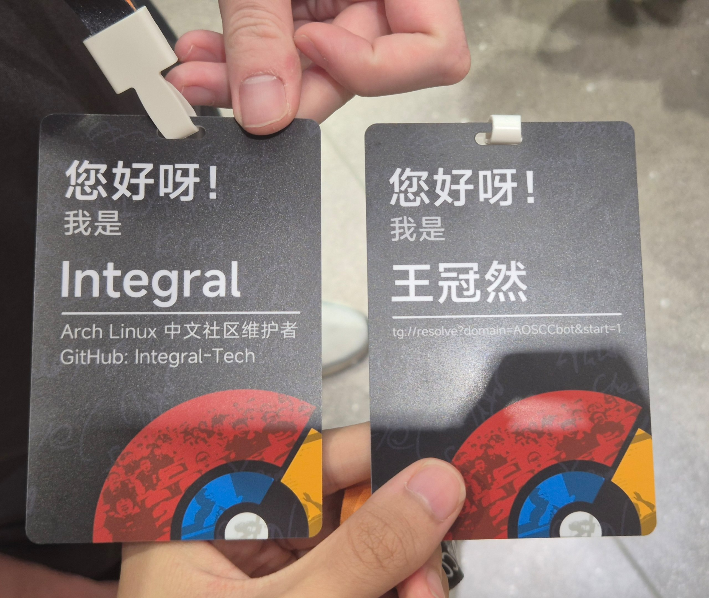
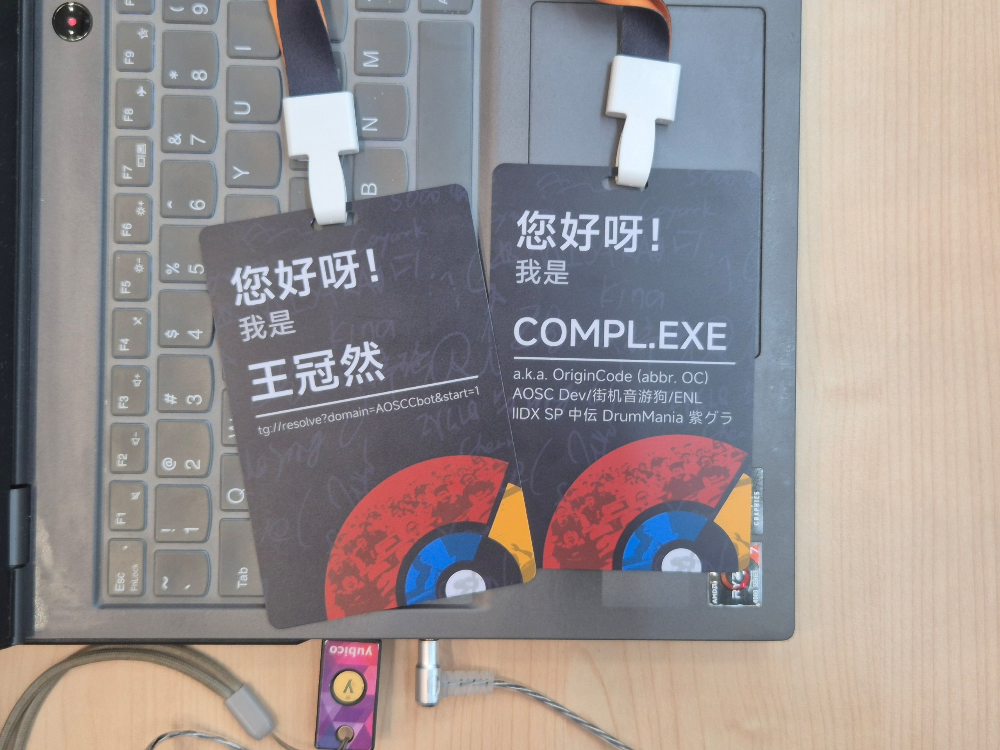
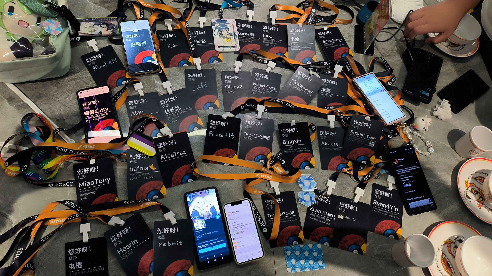
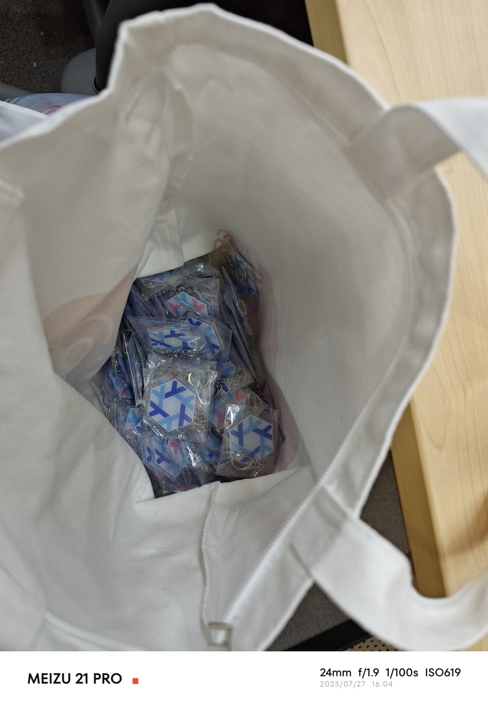

+++
title = 'AOSCC 2025 游记'
date = 2025-07-28T00:13:41+08:00
tags = ['游记', 'AOSCC']
+++

# 序

> AOSCC 是安同开源社区举办的一年一度的线下活动，于 7 月 26–27 日在上海交通大学举行。详见：https://aosc.io/aoscc/2025。

AOSCC 大概是我在国内见过线下活动最多的社区？这次 AOSCC 在上交大举行，年少无知的我也是第一次坐地铁到上海参加大型活动。在活动里我见到了很多认识的群友，也认识了很多新朋友！~~作为半个社恐的我已经是很不错了~~……

好了这篇其实就是流水账。

---

## 第零天（07/25）

这天没什么太值得说的：从家坐了快两个小时地铁到北京南站，又坐了四个多小时的高铁到了上海虹桥，最终又双叒叕坐了快两个小时地铁到 AOSCC 的协议酒店。

夏季的上海给我的第一印象就是潮湿、闷热和伴随阵雨。或许这就是台风天？下了火车首先感到的就是扑面而来的湿气，出门也感觉像是在大海里游泳（。

到酒店办理入住后就去参加贡献者聚餐了。凑巧的是，坐在我右手边的正是之前在 NixOS 群里见过的 @A1ca7raz 老师，~~但因为我太紧张也没说什么话，甚至人家走了都没反应过来说再见~~。

---

## 第一天（07/26）

早上八点起床，吃完早饭就直接去参加活动了。上交大作为国内 top 高校，设施和环境也是足够顶级的（比如会场内每个座椅旁都有电源！）。校区真的很大。比较可惜的是，不像上次去北航，这次因为时间原因没参观太多。

到了会场第一件事是签到然后领取纪念品，我总共买了三件衣服（有点小贵！而且志愿者们真的很辛苦

早上先见了 @Grass_block 和 @Glucy2，然后就选了个比较近的座位（~~其实压根没什么互动~~）。



第一天的讲题有年度工作报告、oma 包管理、HarmonyOS 上写的 Termux 等等，社区氛围真的很活跃。

~~中午吃的麦当劳，有点后悔~~（

下午 @ryan4yin 老师到会场后，在茶歇时间终于见到本人了，简单聊了聊 Asahi Linux 什么的就回座位了。主要还是感觉聊天环节有点短，~~希望明年能优化一下~~（



晚饭是和 @ryan4yin 老师以及 @diredocks 一起吃的火锅，可惜忘记拍照了……

---

## 第二天（07/27）

因为昨晚水群水到快两点，今天也成功地没能早起。吃完早饭距离讲座开始还有半小时，~~但出酒店时看到 @OriginCode 老师在旁边蹭车才发现我不是一个人~~。

中午在 NixOS 群里找到了很多一同参加 AOSCC 的群友一起去吃了萨莉亚。



下午的休息时间高效地捉到了肥猫老师（其实就坐在我身后）、Integral 老师、OriginCode 老师，也算是追星成功了（笑）。





晚上发现可以和另一拨人一起聚餐，于是把吃饭计划合并了一下。我们合并后大概也是全 AOSCC 最多人聚餐？

总之活动也是圆满结束了。离开的时候还拿到了 @Z_h_4_0_L_e_1_Z_O_O_B 发的 Nix 钥匙串（




~~今天讲题太 technical 了，完全没听进去，在讲座里水群的我真的和上网课摸鱼的感觉一模一样~~（

---

## 第三天（07/28）

```rust
fn main() {
    todo!("wait for the future to arrive");
}
```

## 总结

感谢各位群友/老师愿意和我面，大家真的很包容而且特别热情，这次 AOSCC 的体验也真的很好！
