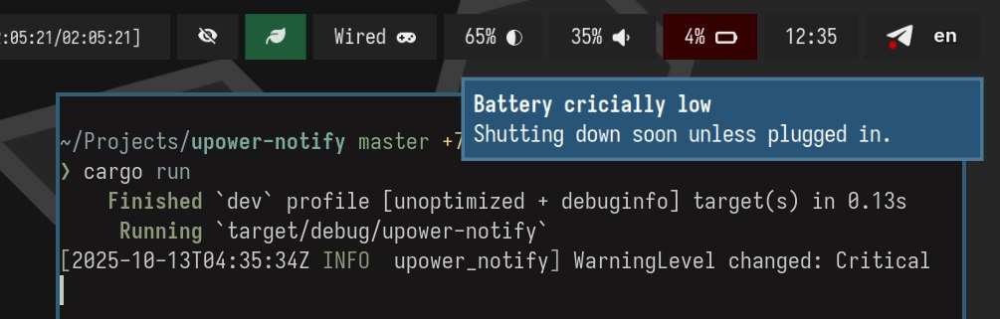

+++
title = '低电量通知'
date = 2025-10-14T03:47:08+08:00
draft = true
+++

## UPower

在 Linux 下，笔记本电池的电量通常由 UPower 读取，其他程序再通过 UPower 获取数据，从而避免不同软件重复查询电量。

当 UPower 判断电量过低时，它会在 D-Bus 的 org.freedesktop.UPower.Device 接口中，将 WarningLevel 从 0: None 切换为 3: Low 或 4: Critical。

我们先来看一下各个数值的含义。根据 UPower 的文档：

```markdown
Warning level of the battery:

- 0: Unknown
- 1: None
- 2: Discharging (only for UPSes)
- 3: Low
- 4: Critical
- 5: Action
```

那这些 WarningLevel 是在什么条件下触发的呢？我找到了[相关源码](https://gitlab.freedesktop.org/upower/upower/-/blob/master/src/up-daemon.c#L765)，里面根据 `{low,critical,action}_{percentage,time}` 这六个变量判断目前电池 WarningLevel 的状态。

默认配置 (/etc/UPower/UPower.conf) 的具体逻辑大致如下：

如果电量百分比

- 低于 20，WarningLevel 即为 3: Low
- 低于 5，WarningLevel 即为 4: Critical
- 低于 2，WarningLevel 即为 5: Action

  与此同时 UPower 会通过 D-Bus 向 systemd-logind 发送 UPower.conf 配置中的 `CriticalPowerAction`，从而触发休眠或关机。

## 通知

在 GNOME 环境下，UPower 的 `WarningLevel` 会由 [gsd-power](https://gitlab.gnome.org/GNOME/gnome-settings-daemon/-/tree/main/plugins/power?ref_type=heads) 处理，并在需要时向用户发送低电量通知。

 u/benjaminnyc](./gsd-power.png)

但如果你使用的是一个精简的窗口管理器，桌面环境只提供最基本的功能。许多额外的功能（比如电量通知、自动关机）通常需要用户自行配置或通过其他软件实现。

也就是说，如果你什么都不配置，当电池耗尽时，笔记本只会**直接断电**。这可能导致文件系统错误，比如文件损坏或丢失——这显然不是我们想要的结果。

于是我手动安装了 UPower，在 NixOS 上你只需要以下配置：

```nix
services.upower = {
  enable = true;
  criticalPowerAction = "PowerOff"; # 我不太喜欢默认的 HybirdSleep
};
```

于是低电量自动关机就有了！但是因为我们不是 GNOME，没有 gsd-power，于是不会有任何低电量通知。

那我们写一个监听 D-Bus 上的 WarningLevel 的软件吧！检测到 WarningLevel 为 3: Low 或者 4: Critical 时就发送低电量通知。

## 实现

最后[我的实现](https://github.com/Guanran928/upower-notify)很简单，用 Rust 与 `zbus`、`notify-rust` 这两个库写了个很简单的软件。

```rust
use ...;

/// Simple program to send notifications on battery status changes
#[derive(Parser, Debug)]
#[command(version, about, long_about = None)]
struct Args {
    /// D-Bus address of the battery device
    #[arg(
        short,
        long,
        default_value = "/org/freedesktop/UPower/devices/battery_BAT0"
    )]
    device: String,
}

#[derive(Debug, OwnedValue)]
#[repr(u32)]
pub enum WarningLevel {
    Unknown = 0,
    None = 1,
    Discharging = 2,
    Low = 3,
    Critical = 4,
    Action = 5,
}

#[proxy(
    interface = "org.freedesktop.UPower.Device",
    default_service = "org.freedesktop.UPower",
    assume_defaults = false
)]
pub trait Device {
    #[zbus(property)]
    fn percentage(&self) -> zbus::Result<f64>;
    #[zbus(property)]
    fn time_to_empty(&self) -> zbus::Result<i64>;
    #[zbus(property)]
    fn warning_level(&self) -> zbus::Result<WarningLevel>;
}

#[tokio::main]
async fn main() -> Result<()> {
    let args = Args::parse();

    let connection = Connection::system().await?;
    let upower = DeviceProxy::new(&connection, args.device).await?;
    let mut stream = upower.receive_warning_level_changed().await;

    while let Some(event) = stream.next().await {
        let event = event.get().await?;
        match event {
            WarningLevel::Low => {
                let time_to_empty = Duration::new(upower.time_to_empty().await? as u64, 0);
                let percentage = upower.percentage().await?;

                Notification::new()
                    .summary("Battery low")
                    .body(&format!(
                        "Approximately <b>{}</b> remaining ({}%)",
                        format_duration(time_to_empty),
                        percentage
                    ))
                    .timeout(Timeout::Never)
                    .show()?;
            }
            WarningLevel::Critical => {
                Notification::new()
                    .summary("Battery critically low")
                    .body("Shutting down soon unless plugged in.")
                    .timeout(0)
                    .show()?;
            }
            WarningLevel::Action => {
                Notification::new()
                    .summary("Battery critically low")
                    .body("The battery is below the critical level and this computer is about to shutdown.")
                    .timeout(0)
                    .show()?;
            }
            _ => {}
        }
    }

    Ok(())
}

fn format_duration(duration: Duration) -> String {
  ...
}
```

... and it works!


